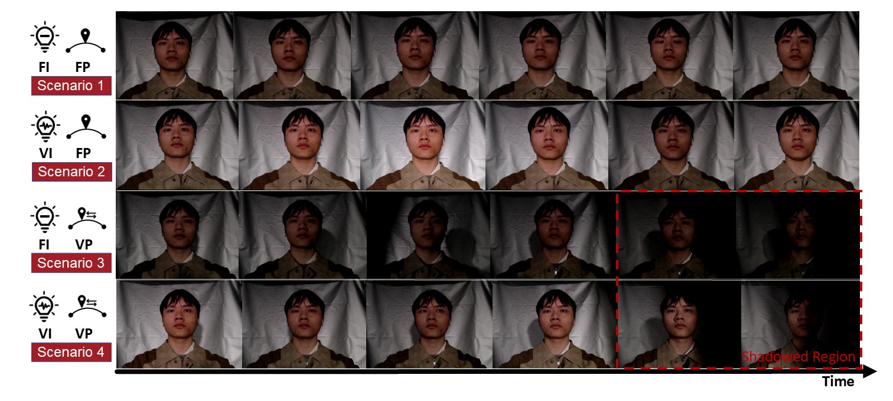

## 📌 Dataset: DLCN

**DLCN (Dynamic-lighting Conditions at Night)** is a dataset collected specifically for rPPG signal evaluation under complex lighting environments.

### 💾  Dataset Structure
> 🗂 File Format: `.h5`. All sample data are stored in individual directories, such as `P001`. Each directory contains eight subfolders named `v01` to `v08`, corresponding to data collected under different scenarios. The details are as follows:

- **For the two states during the preparation phase:**
  - `v01` to `v04`: Data from the **rest state**
  - `v05` to `v08`: Data from the **exerce state**

- **For different lighting conditions:**
  - `v01`, `v05`: Fixed Intensity & Fixed Position (**FI & VI**)
  - `v02`, `v06`: Varying Intensity & Fixed Position (**FI & VI**)
  - `v03`, `v07`: Fixed Intensity & Varying Position (**FI & VI**)
  - `v04`, `v08`: Varying Intensity & Varying Position (**FI & VI**)

### 📷 Sample Frame Snapshots



### 🔧 


## 📬 Contact

For issues, suggestions, or collaborations:
📧 Email: zhipengli@stu.cqut.edu.cn

##  📚 Citation
If you use this toolkit or the DCLN dataset, please cite:
````
@article{your_paper,
  title={Happy-rPPG: A Toolkit and Dataset for Remote Photoplethysmography under Dynamic Lighting at Night},
  author={},
  journal={},
  year={2025}
}
````